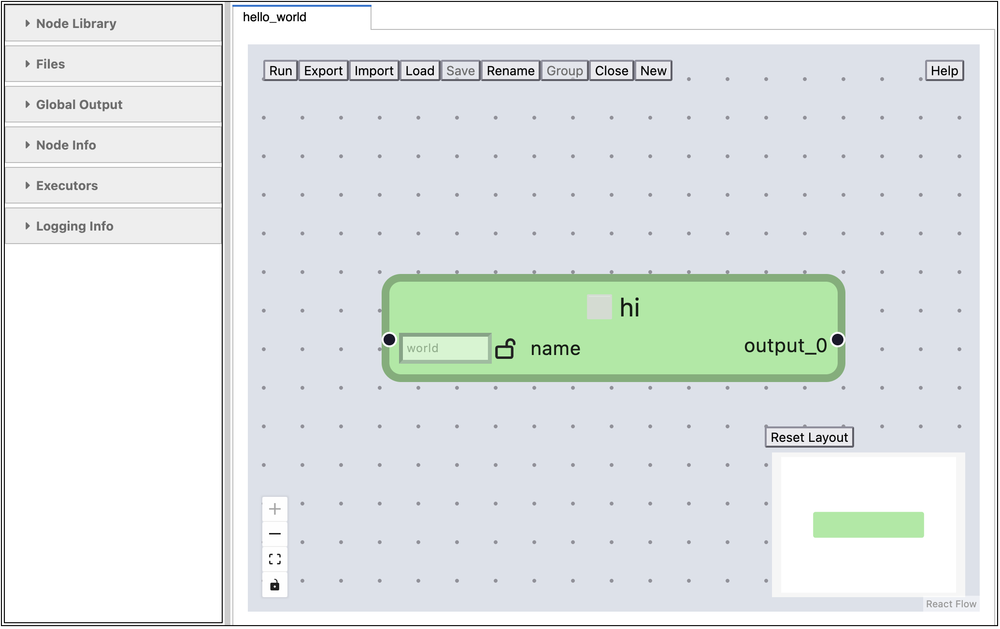

# pyironFlow

[](https://github.com/pyiron/pyironflow/actions/workflows/push-pull.yml)
[](https://codecov.io/gh/pyiron/pyironflow)
[](https://mybinder.org/v2/gh/pyiron/pyironFlow/HEAD?labpath=minimal_demo.ipynb)

The visual programming interface `pyironflow.PyironFlow` is a GUI skin based on [ReactFlow](https://reactflow.dev/) that works on top of `pyiron_workflow` with `flowrep` data formats. 

To get running, open up a Jupyter notebook and 

```python
import pyironflow

pf = pyironflow.PyironFlow()
pf.gui

```

Or pre-populate the GUI with a workflow you've already written:

```python
import flowrep as fr
import pyiron_workflow as pwf

import pyironflow

@fr.atomic
def hello(name: str = "world") -> str:
    return f"Hello, {name}"

wf = pwf.Workflow("hello_world")
wf.hi = pwf.node(hello)

pf = pyironflow.PyironFlow([wf])
pf.gui

```



The [user guide](https://github.com/pyiron/pyironFlow/blob/main/docs/user_guide.md) outlines available capabilities.

## Installation

A package of `pyironflow` is available on PyPI and [conda-forge](https://anaconda.org/conda-forge/pyironflow). This can be installed using:
```
conda install -c conda-forge pyironflow   # recommended
pip install pyironflow                    # also available from PyPI
```

The `pyironflow` gui is intended to be used inside a Jupyter notebook, was additionally recommend installing [jupyterlab](https://anaconda.org/conda-forge/jupyterlab):
```
conda install -c conda-forge jupyterlab
```
